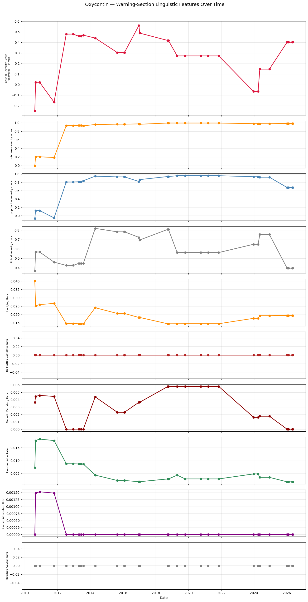
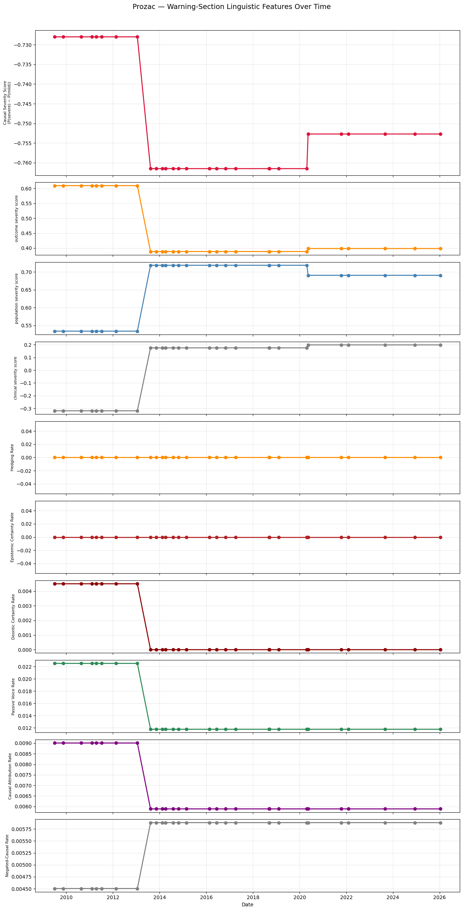
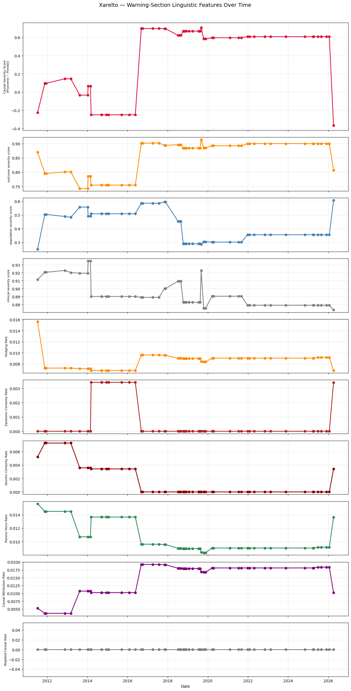
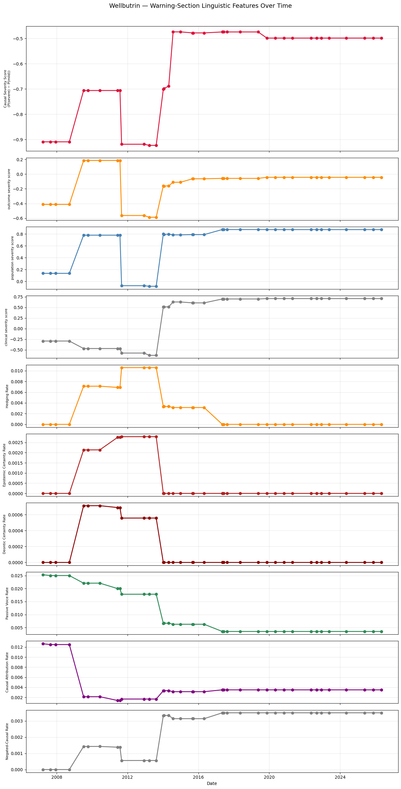
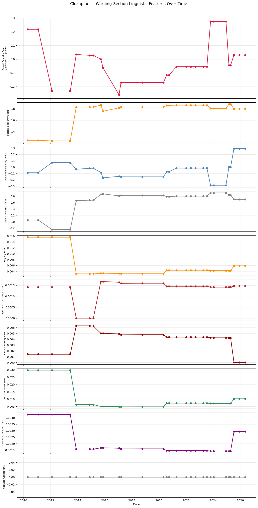

# Natural Language Inference Analysis for FDA Drug Labels

**David Xu, Garv Goswami — UC Berkeley**

---

## Overview

This repository contains the code, pipeline, and results for our paper *Natural Language Inference Analysis for FDA Drug Labels*. We present a longitudinal framework for measuring the **rhetorical posture of risk communications** across FDA drug label revisions using zero-shot Natural Language Inference (NLI).

---

## Method

Each archived warning section is scored against four hypothesis dimensions using `facebook/bart-large-mnli` (Yin et al., 2019):

| Dimension | Measures |
|---|---|
| **Causal Certainty** | Whether the label makes direct, unhedged assertions that the drug causes specific harmful outcomes |
| **Outcome Severity** | Whether the label describes risks that are life-threatening, fatal, or cause permanent harm |
| **Population Breadth** | Whether the label describes risks that apply broadly to most or all patients |
| **Clinical Actionability** | Whether the label requires specific urgent clinical actions such as monitoring or discontinuation |

Each dimension is scored as `P(severe) − P(mild) ∈ [−1, +1]`, giving a four-dimensional severity profile per label version tracked over time.

---

## Selected Results

### OxyContin — Dramatic escalation across all dimensions

The 2012–2013 ER/LA Opioid Analgesics REMS mandated sweeping label revisions across the opioid class. Outcome and population severity hit near-ceiling and remain there through 2026, while causal severity reflects continued FDA renegotiation of how directly to assert the addiction-death causal chain throughout the opioid crisis years.



---

### Prozac — Coordinated restructuring at a single inflection point

The 2013 SSRI label standardization effort produces a simultaneous shift across all four NLI dimensions. Notably, outcome severity *decreases* post-2013 despite the maintained boxed warning.



---

### Xarelto — Causal escalation with population narrowing

The 2016–2018 COMPASS trial results and subsequent cardiovascular indication expansion produce a dramatic jump in causal severity from −0.25 to +0.65, while population severity simultaneously narrows. The drug became more assertive about causing cardiovascular benefit while becoming more specific about who faces bleeding risk.



---

### Wellbutrin — Two discrete regulatory events, two detected inflections

A 2009 boxed warning addition for neuropsychiatric adverse events in smoking cessation use produces the first inflection. A 2016 FDA reassessment reducing the severity of those warnings produces the second. Two documented regulatory events producing two discrete rhetorical shifts in the pipeline output.



---

### Clozapine — REMS lifecycle from inception to removal

The 2015 launch of the Clozapine REMS program for agranulocytosis monitoring produces the dominant inflection. The 2025 FDA removal of the REMS requirement is visible as a late-archive shift as monitoring language was removed from the label itself.



---

## Corpus Construction

Candidate drugs were drawn from two sources:

- **ClinCalc DrugStats top 100** most prescribed US outpatient medications (Kane, 2023), ensuring broad clinical relevance
- **Supplementary set** of drugs with documented significant regulatory revision histories, spanning opioids, antipsychotics, SSRIs/SNRIs, anticoagulants, biologics, and diabetes medications

All candidates were filtered programmatically via the DailyMed archive API for a minimum of **20 archived label versions**. 28 of 150 candidates qualified.

---

## Repository Structure

```
├── drug_label_analysis_v5_6.ipynb   # Full pipeline: scraping, NLI scoring, plotting
├── drug_scan_results.csv            # Archive depth scan for all 150 candidates  
├── figures/                         # Output plots for all 28 qualified drugs
│   ├── oxycontin.png
│   ├── prozac.png
│   ├── xarelto.png
│   ├── wellbutrin.png
│   ├── clozapine.png
│   └── ...
├── Natural_Lang_Analysis_for_FDA_Drug_labels.pdf
└── README.md
```

---

## Requirements

```
transformers>=4.30.0
torch>=2.0.0
spacy>=3.5.0
beautifulsoup4
lxml
pandas
matplotlib
requests
```

Install spaCy English model:
```bash
python -m spacy download en_core_web_sm
```

---

## Usage

1. Open `drug_label_analysis_v5_6.ipynb` in Google Colab
2. Set runtime to **T4 GPU** (Runtime → Change runtime type) — NLI inference on CPU is ~15 min/drug
3. Run the **GPU check cell** to confirm CUDA availability
4. Run the **drug candidate scanner** to reproduce corpus selection, or load from `drug_scan_results.csv`
5. Run the **full pipeline** — results are cached per drug as `.pkl` files to allow resumption after disconnection
6. Plots are saved to `/content/` as `{drug}_features_v2.png`

The pipeline is fully reproducible from public data via the DailyMed and NCBI E-utilities APIs. No proprietary data or manual annotation is required.

---

## Citation

```bibtex
@article{xu2026nlifda,
  title     = {Natural Language Inference Analysis for {FDA} Drug Labels},
  author    = {Xu, David and Goswami, Garv},
  year      = {2026},
  institution = {UC Berkeley}
}
```

---

## Data Source

All drug label data is sourced from [DailyMed](https://dailymed.nlm.nih.gov/dailymed/), the National Library of Medicine's official repository of FDA-submitted drug labeling, via public API. No proprietary data is used. PubMed abstract data is sourced via the [NCBI E-utilities API](https://www.ncbi.nlm.nih.gov/books/NBK25501/).